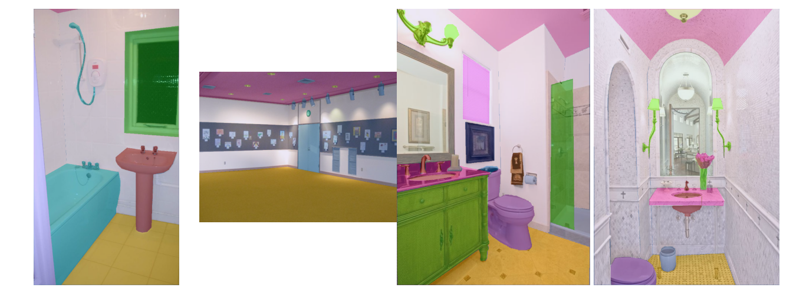
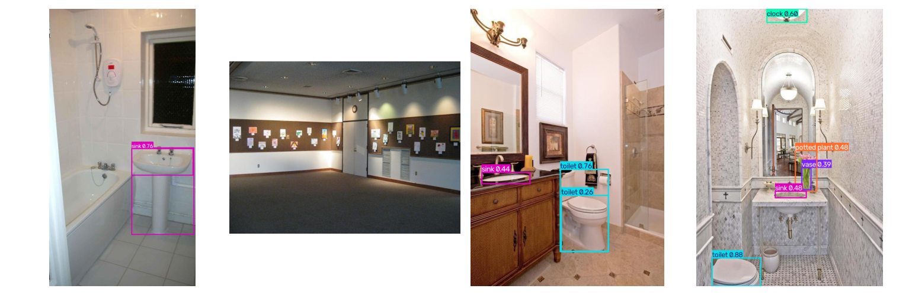
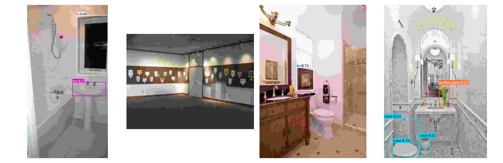
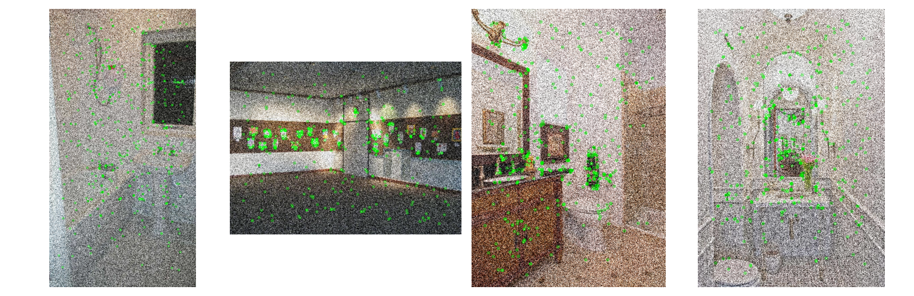
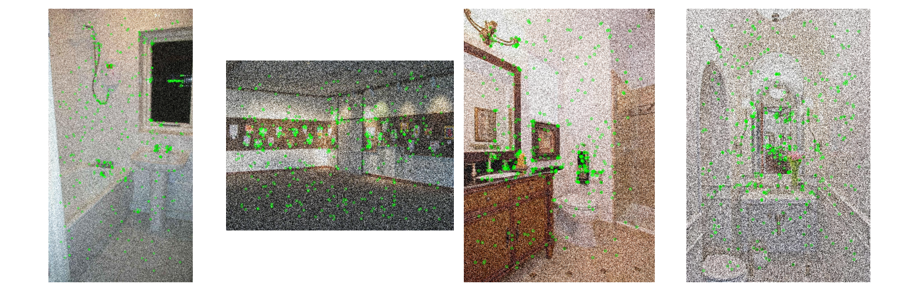
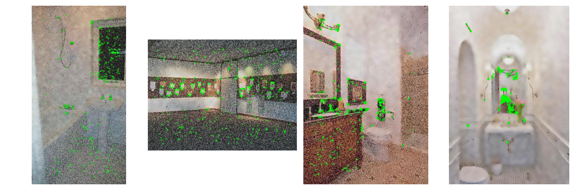
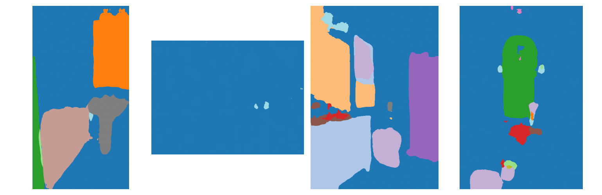
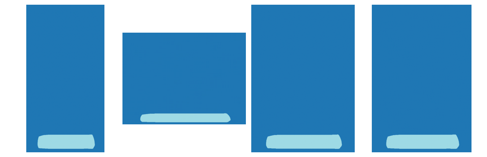

# Image_Processing_Final_Project
Evaluating the robustness of computer vision models,  under image distortions, and mitigating degradation using pre-processing enhancement and fine-tuning.
# Evaluating the Robustness of Image Processing and Vision Icons

## Project Overview
This project evaluates the robustness of various image processing and computer vision algorithms under common environmental and digital distortions. We analyze performance degradation across low-level and high-level vision tasks and investigate two mitigation approaches: image enhancement (pre-processing) and model fine-tuning.

---

## Dataset
* **Selected Dataset:** `ADE20K-Tiny` (loaded directly via HuggingFace `datasets`).
* **Ground Truth:** Includes semantic segmentation maps. For object detection and feature matching, baseline clean image inferences serve as the pseudo-ground truth.

---

## Project Choices & Configuration

The project implements 3 distinct vision tasks, subjected to 3 different distortions, and evaluated using specific robustness metrics:

| Vision Task | Algorithm / Model | Evaluation Metric | Image Distortion | Enhancement Method |
| :--- | :--- | :--- | :--- | :--- |
| **Feature Detection** | **ORB** (OpenCV) | Good Matches / Clean Keypoints Ratio | **GaussNoise** (Albumentations) | Fast Non-Local Means (NLM) |
| **Object Detection** | **YOLOv8** (Ultralytics) | Mean Detection Recall | **Severe JPEG Compression** | Bilateral Filtering |
| **Semantic Segmentation** | **SegFormer** (NVIDIA) | mean Intersection over Union (mIoU) | **Low Light** (Brightness Contrast) | Gamma Correction + CLAHE |

---

## Quantitative Performance Summary

The table below presents the full quantitative evaluation across all three vision pipelines under clean, distorted, and enhanced (mitigated) states:

| Vision Task | Metric | Baseline (Clean) | Distorted | Enhanced (Mitigation) | Fine-Tuned Model |
| :--- | :--- | :--- | :--- | :--- | :--- |
| **Object Detection (YOLOv8)** | Recall (vs Baseline) | 1.000 | 0.067 | 0.633 | *Pending Eval* |
| **Feature Detection (ORB)** | Matching Ratio | 1.000 | 0.420 | 0.331 | N/A (Classical Task) |
| **Segmentation (SegFormer)** | mean IoU (vs GT) | 0.532 | 0.000 | 0.000 | N/A (Pending Step) |

---

## Experimental Progress & Visual Milestones

### 1. Dataset Exploration & Baseline Visualization (`src/baseline.py`)
Successfully configured the data pipeline to load `ade20k-tiny` and implemented alpha-blending to visualize the baseline clean images alongside their official segmentation masks.

### 2. Object Detection Tasks (YOLOv8 & JPEG Compression)
Severe JPEG compression completely degraded structural features, dropping model Recall to a critical **0.067**. Pre-processing with a **Bilateral Filter** successfully recovered broken edges, restoring the Recall significantly to **0.633**.

* **Baseline Clean Detections:**

* **Distorted (JPEG Compressed Quality=5):**

* **Mitigated (Bilateral Filter Restored):**

### 3. Feature Detection Tasks (ORB & Gaussian Noise)
Gaussian Noise disrupted localized pixel gradients, dropping ORB matching accuracy to **0.420**. Aggressive NLM filtering ($h=35$) cleared the background noise visually and returned keypoints to physical objects, but the resulting pixel smoothing altered the descriptor distributions, yielding a matching ratio of **0.331**.

* **Baseline Clean Keypoints:**

* **Distorted (Gaussian Noise Applied):**

* **Initial Denoising Attempt (NLM with h=15):**

* **Optimized Denoising (NLM with h=35):**

### 4. Semantic Segmentation Tasks (SegFormer & Low Light)
The baseline model achieved a **0.532 mIoU** against the Ground Truth. Severe low-light distortion caused a total activation collapse (**0.000 mIoU**). Classical illumination filtering (Gamma + CLAHE) failed to recover performance (**0.000 mIoU**) due to non-linear distribution warping that disrupted the network's internal layer normalizations.

* **Baseline Clean Segmentation Maps:**

* **Distorted (Severe Low Light Applied):**

* **Mitigated (Gamma Correction + CLAHE):**

### 5. Model Fine-Tuning Pipeline (YOLOv8 - Week 10)
* **Status:** Completed
* **Description:** Implemented an end-to-end local fine-tuning pipeline (`src/yolo_finetune.py`) to adapt the object detection model to severe digital distortions.
* **Methodology:** Generated robust **Pseudo-Labels** by extracting bounding box predictions from clean baseline images (confidence threshold = 0.35, IoU threshold = 0.5). The baseline model was then fine-tuned directly on the JPEG-distorted images for 3 epochs with a batch size of 2.
* **Training Outcomes:** The network successfully adapted its convolutional feature extractors to blocky compression artifacts, achieving a final validation Precision score of **0.971** across target object classes (toilet, sink, clock). The optimized weights were successfully exported to `runs/detect/train/weights/best.pt`.

---

## Next Computational Steps
1. **Evaluate Fine-Tuned Performance (Week 11):** Run the core evaluation loop using the newly fine-tuned YOLOv8 weights to compare deep domain adaptation metrics against traditional pre-processing filters.